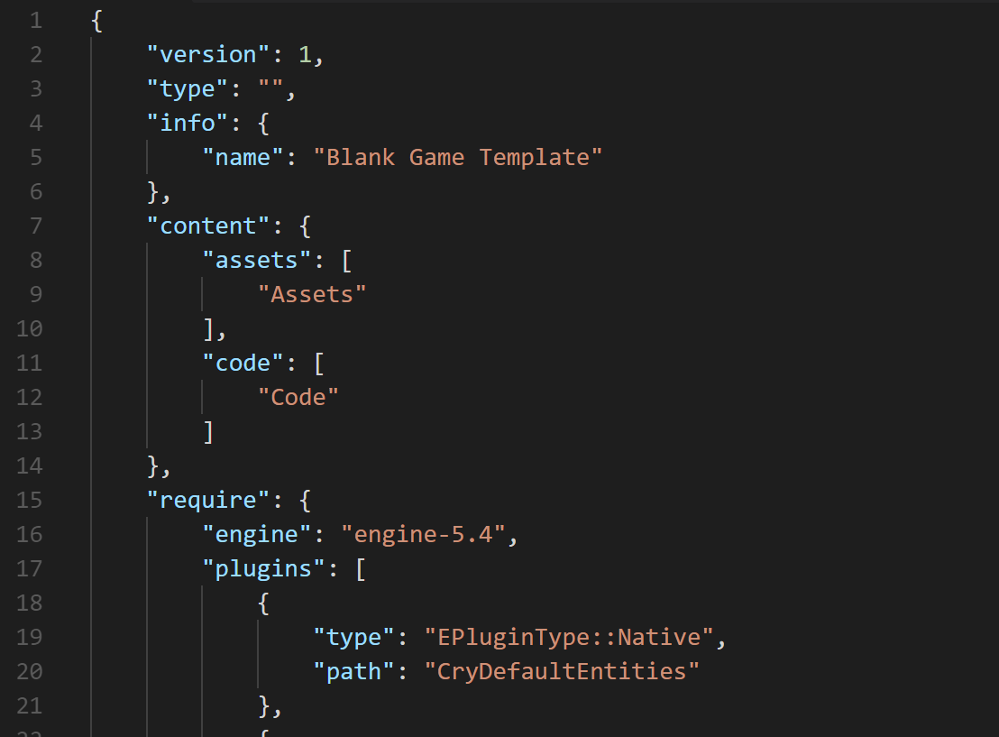
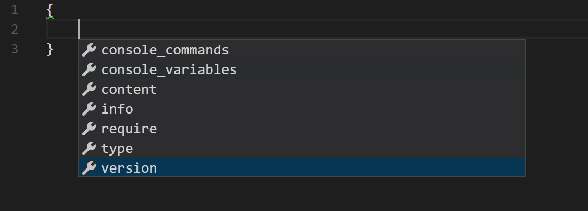
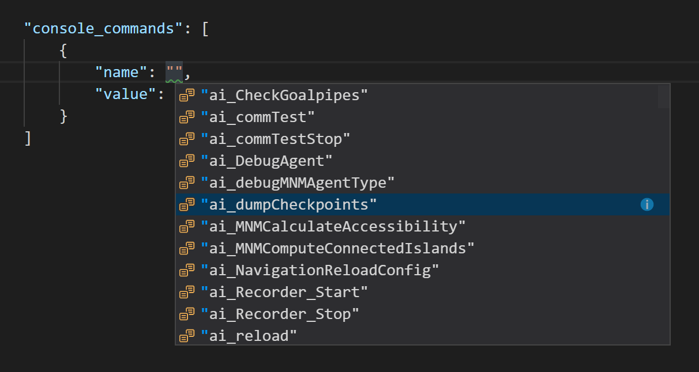

# CryProj README

A simple extension for Visual Studio Code that adds support for .cryproj files.

*Note: This is an unofficial project and it's not affiliated with Crytek and/or [CRYENGINE](https://github.com/CRYTEK/CRYENGINE).*

## Features
This extension will add to your editor the following features:

 - [Code theming](#Code-theming)
 - [Suggestions](#Suggestions)
 - [A list of console variables and commands](#A-list-of-console-variables-and-commands)

### Code theming

### Suggestions

### A list of console variables and commands

 

## Requirements

This extension will work with Visual Studio Code 0.10.0 and later.

## Known Issues

None. If you find one, plase [open a Issue](https://github.com/l0ll098/CryProj/issues/new).

## Release Notes

See [CHANGELOG.md](./CHANGELOG.md)
